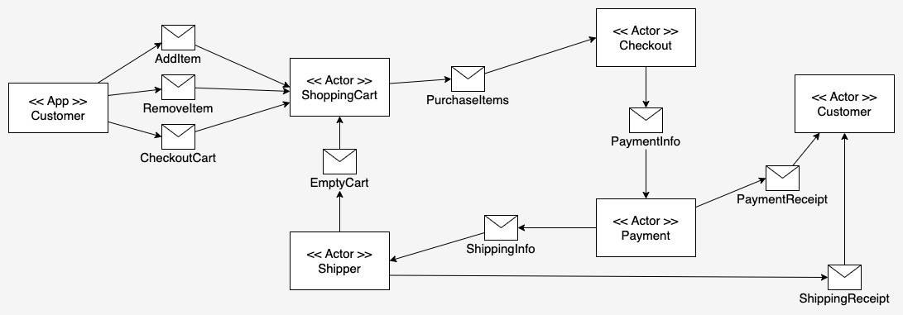

# Implementing the cascading style of the Actor Model under Akka

This project is an implementation of the cascading style of the Actor Model. In the cascading in which actors operate
sequentially, yet independently toward a given end in a workflow can be thought of as a cascading style. 
Figure 1 below illustrates an example of implementing the Barry Peanuts Shopping Cart demonstration application in such a style.

|  |
|----------------------------------------------------------|
| Figure 1: The cascading style of the Actor Model         |