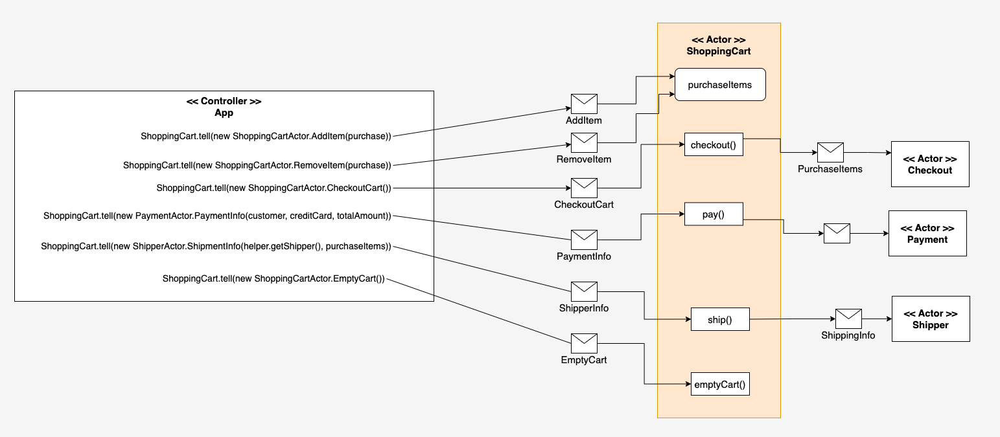

# Implementing a flattened version of the Actor model under Akka

This project is an example of the flattened style of the Actor Model under Akka.

In the flat style there is a central controller actor, in this case the Application which in turn,
controls the behavior in the workflow exclusively through the ShoppingCart. The ShoppingCart delegates
various behaviors to other actors. For example, telling the ShoppingCart to `checkout` will, in turn, have
the ShoppingCart fire off a message to the CheckOut actor. Once the checkout process is completed,
the Shopping cart then sends a message to the Payment actor to instigate payment behavior.
After payment completes, the ShoppingCart sends a message to the Shipper actor to facilitate shipping. (See Figure 1.)

||
| -------- |
|Figure 1: The flat actor-controller implementation|

One benefit of the flat style is the ease of implementation as well as ease of maintenance.